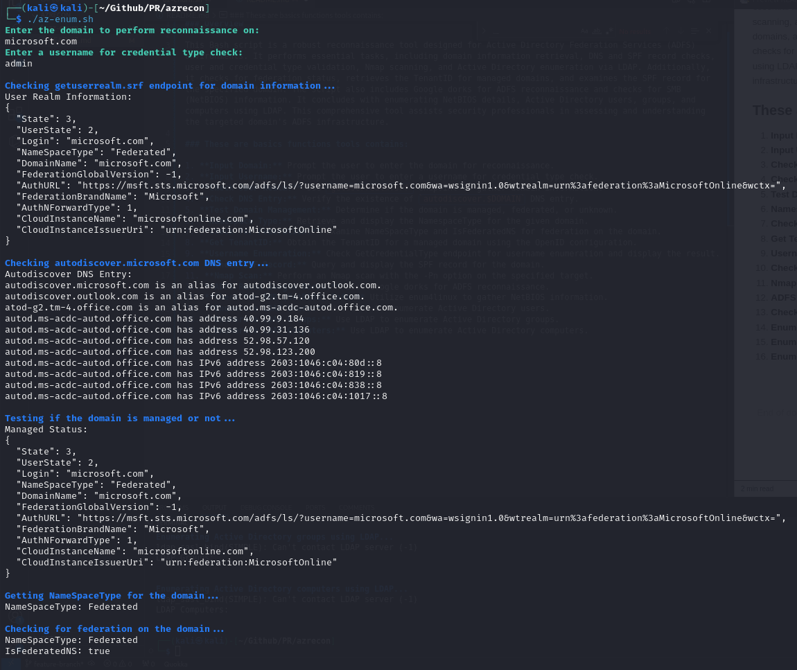

### Overview

This Bash script is a robust reconnaissance tool designed for Active Directory Federation Services (ADFS) environments. It performs essential tasks, including domain information retrieval, DNS and SPF record checks, user and credential type validation, Nmap scanning, and Active Directory enumeration via LDAP. Additionally, it checks for federation status, retrieves the TenantID for managed domains, and examines the SPF record for the specified domain. The script also includes Google dorks for ADFS reconnaissance and checks for SMB (NetBIOS) information. It concludes with enumerating NetBIOS details, Active Directory users, groups, and computers using LDAP. This comprehensive tool assists security professionals in assessing and understanding the targeted domain's ADFS infrastructure.

### These are basics functions tools contains:

| No. | Function                          | Description                                                                       |
| --- | --------------------------------- | --------------------------------------------------------------------------------- |
| 1   | **Input Domain:**                 | Prompt the user to enter the domain for reconnaissance.                           |
| 2   | **Input Username:**               | Prompt the user to enter a username for credential type check.                    |
| 3   | **Check User Realm:**             | Use `getuserrealm.srf` endpoint to gather domain information.                     |
| 4   | **Check DNS Entry:**              | Verify the existence of `autodiscover.$DOMAIN` DNS entry.                         |
| 5   | **Test Domain Management:**       | Determine if the domain is managed, federated, or unknown.                        |
| 6   | **Namespace Type:**               | Retrieve and display the NamespaceType for the given domain.                      |
| 7   | **Check for Federation:**         | Examine NameSpaceType and IsFederatedNS for federation on the domain.             |
| 8   | **Get TenantID:**                 | Obtain the TenantID for a managed domain using the OpenID configuration.          |
| 9   | **Username Enumeration:**         | Check GetCredentialType endpoint for username enumeration and display the result. |
| 10  | **Check SPF Record:**             | Query and display the SPF record for the domain.                                  |
| 11  | **Nmap Scan:**                    | Perform an Nmap scan with the -Pn option on the specified target.                 |
| 12  | **ADFS Recon Google Dorks:**      | List Google dorks for ADFS reconnaissance.                                        |
| 13  | **Check for SMB (NetBIOS) Info:** | Utilize enum4linux to gather NetBIOS information.                                 |
| 14  | **Enumerate LDAP Users:**         | Use LDAP to enumerate Active Directory users.                                     |
| 15  | **Enumerate LDAP Groups:**        | Use LDAP to enumerate Active Directory groups.                                    |
| 16  | **Enumerate LDAP Computers:**     | Use LDAP to enumerate Active Directory computers.                                 |
|     |                                   |                                                                                   |

